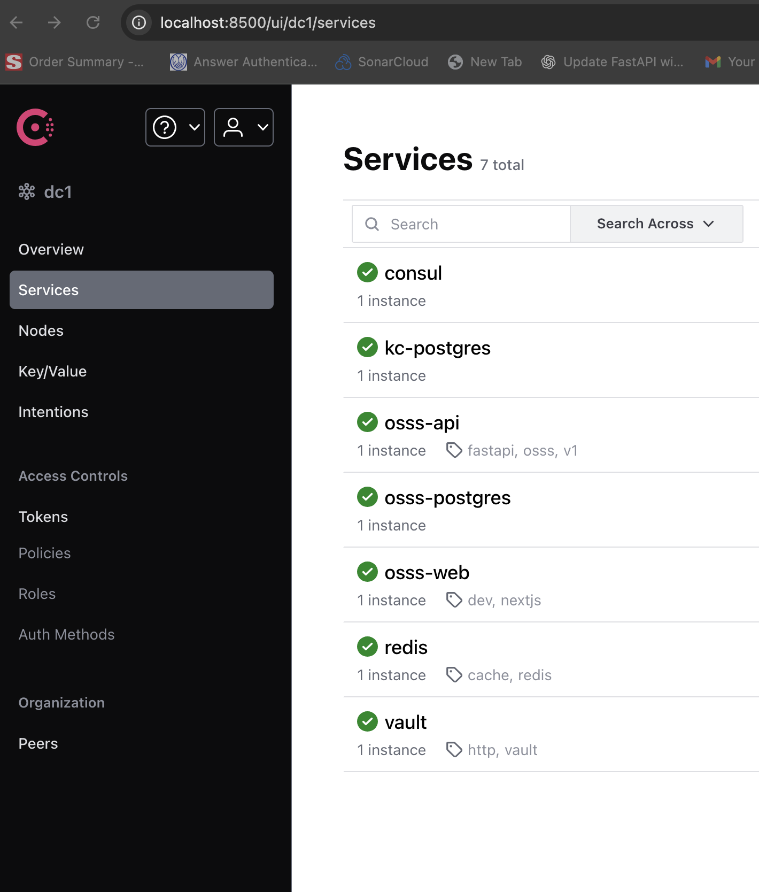
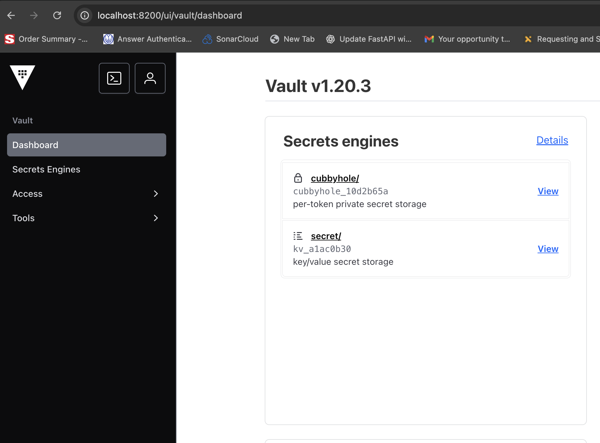

!!! warning "Project status: active development"
    **OSSS is still being developed.** Community input and assistance are very welcome!
    - Share feedback and ideas via issues or discussions.
    - Open PRs for bug fixes and small improvements.

# Open Source School Software (OSSS)

<!-- badges: start -->
<p align="center">
  <a href="https://github.com/rubelw/OSSS/blob/main/LICENSE"></a>
  
  
  
  
  
  <a href="https://rubelw.github.io/OSSS/"></a>
</p>
<!-- badges: end -->

> Open Source School Software (K-12 SIS) — FastAPI + Keycloak + SQLAlchemy + Datalake + Ollama + MetaGPT + A2A; governance + student info + accounting + activites + transportation.


A community-driven, modular suite of applications for K-12 districts.

> 📚 **Live documentation:** https://rubelw.github.io/OSSS/

This repository is a **polyglot monorepo** with a Next.js frontend (`src/osss-web`) and a FastAPI
backend (`src/OSSS`). Documentation is built with **MkDocs Material**, with API references
generated from source:

- **Frontend (TypeScript)** → TypeDoc → Markdown (`docs/api/web/*`)
- **Backend (Python)** → mkdocstrings renders code objects from `src/OSSS`
- **REST (OpenAPI)** → exported JSON rendered with ReDoc
- **AI (Ollama + MetaGPT + A2A)**

---
## Network diagram

<p align="center">
  
</p>

---
# Screen Shots

The static site is output to `./documentation/`.


Consul example:



Vault example:



Keycloak example:


Kibana example:


Zulip (Chat) example:


Taiga (Task/Project Management) example:


---

Rasa Mentor example:


AI Tutor Example:


AI Guardrail Example:


A2A Dashboard Example:


General AI Chat Example:


AI Slot-Agent Example:


## Why This Is Important

When Artificial General Intelligence (AGI) starts to emerge—potentially by 2030—districts will need to adjust governance, safety filters, and curricula rapidly. That kind of agility is exactly what community-maintained, open-source software delivers—without waiting on a vendor roadmap. Today, many incumbent systems are tied to legacy architectures and slow release cycles. While AI is already reshaping mainstream apps, most school platforms haven’t meaningfully evolved to leverage it.

We are building the next generation of school software as an open, participatory project. Administrators, staff, students, and families will be able to propose enhancements, contribute code, and ship improvements together—so the platform keeps pace with classroom needs and policy changes.

---
# Development Environment Configuration
```commandline
docker-compose version 1.29.2, build 5becea4c
docker-py version: 5.0.0
CPython version: 3.9.0
OpenSSL version: OpenSSL 1.1.1h  22 Sep 2020

---
# Minimum System Requirements

- **OS:** Linux or macOS (Windows via Docker Desktop + WSL2)
- **CPU:** 4 cores (minimum), 8 cores recommended (Elasticsearch + Keycloak + dev servers)
- **RAM:** 12 GB usable for Docker (minimum), 16 GB+ recommended
- **Disk free:** ~50–60 GB (images + ES/Kibana data + two Postgres volumes)
- **Docker:** Engine 24+ with Compose v2; cgroup v2 enabled on modern Linux
- **Ports:**  
  - 8081 (API)  
  - 3000 (web)  
  - 8080 (Keycloak)  
  - 5433/5434 (Postgres)  
  - 5601 (Kibana)  
  - 9200 (Elasticsearch)  
  - 8200 (Vault)  
  - 8500 (Consul)
  - 8444 (Trino)
  - 8088 (Superset)
  - 8083 (Airflow)
  - 8585 (OpenMetadata)
  - 8082 (OpenMetadata Ingestion)
  - 5005 (Rasa Mentor)
  - 8086 (A2A Server)
  - 9000 (A2A Agent)
  - 8111 (Zulip Chat)
  - 15672 (Zulip RabbitMQ Management UI)
  - 5672 (Zulip RabbitMQ AMQP)
  - 6383 (Zulip Redis)
  - 5438 (Zulip DB)
  - 8120 (Taiga-Gateway)
  - 8103 (Taiga-Protected)
  - 8188 (Taiga-Events)
  - 8100 (Taiga-Back)
  - 8161 (Taiga-RabbitMQ Management UI) 
  - 8162 (Taiga-RabbitMQ AMQP)
  - 5439 (Taiga-DB)
  
  
---

## 📖 Documentation Quick Start

> Run all commands from the **repo root**. Create and activate a Python venv first.  
> Live docs are published at **https://rubelw.github.io/OSSS/**.

### Quick start
```bash
# clone
git clone https://github.com/rubelw/OSSS.git
cd OSSS

# (optional) copy environment examples
cp .env.example .env || true

# create a venv in a folder named .venv (inside your project)
python3 -m venv .venv
source .venv/bin/activate

# build + run local stack (database, API, web)
./start_osss.sh

# to run the cli
osss <TAB>

# Keycloak http://localhost:8080 with username 'admin' and password 'admin'
# Keycloak login to OSSS realm: https://keycloak.local:8443/realms/OSSS/account
# FastApi  http://localhost:8081/docs# username 'activities_director@osss.local' and password 'password'
# Web: http://localhost:3000 username 'activities_director@osss.local' and password 'password'
# Vault: http://localhost:8200 username 'chief_technology_officer@osss.local and password 'password'
# Consul: http://localhost:8500
# Kibana: http://localhost:5601
# ElasticSearch: http://localhost:9200
# Airflow: http://localhost:8083
# Openmetadata: http://localhost:8585
# Superset: http://localhost:8088
```

Build the static site to `./documentation/`:

```bash
# Optional: regenerate TypeDoc first if code changed
npx typedoc --options typedoc.frontend.json
mkdocs build --clean
```

---

## 📁 Docs Layout (MkDocs)

```
docs/
├─ index.md                      # Landing page
├─ frontend/
│  └─ overview.md                # Next.js app overview
├─ backend/
│  └─ overview.md                # FastAPI app overview
├─ api/
│  ├─ web/                       # (generated) TypeDoc markdown for Next.js
│  └─ openapi/                   # (generated) openapi.json for ReDoc
└─ api/python/
   ├─ index.md                   # (generated) landing for Python API
   └─ OSSS.md                    # (generated) mkdocstrings page for OSSS package
```

> The pages under `docs/api/python/` and `docs/api/openapi/` are created during the MkDocs build by
> small helper scripts (see below). TypeDoc output is generated before the build runs.

---

## Demo


## ⚙️ MkDocs Configuration

`mkdocs.yml` at the repo root glues everything together. Key bits:

```yaml
site_name: OSSS Developer Documentation
site_url: https://rubelw.github.io/OSSS/
docs_dir: docs
site_dir: documentation

nav:
  - Overview: index.md
  - Frontend (Next.js):
      - Overview: frontend/overview.md
      - API (TypeScript): api/web/modules.md   # <-- match what TypeDoc emits (modules.md or index.md)
  - Backend (Python):
      - Overview: backend/overview.md
      - API (Python): api/python/OSSS.md
      - OpenAPI: backend/openapi.md

plugins:
  - search
  - mkdocstrings:
      handlers:
        python:
          paths: ["src"]           # import OSSS from ./src/OSSS
          options:
            show_source: false
            docstring_style: google
            members_order: source
  - gen-files:
      scripts:
        - tooling/generate_docs.py
        - tooling/export_openapi.py

# Optional: make pages wider site-wide, or include a page-class-based override
extra_css:
  - overrides/wide.css

# Load ReDoc globally so the OpenAPI page can initialize it
extra_javascript:
  - https://cdn.redoc.ly/redoc/latest/bundles/redoc.standalone.js
```

### Helper scripts (run during `mkdocs serve/build`)

- `tooling/generate_docs.py` — generates `docs/api/python/OSSS.md` that contains the `::: OSSS`
  directive; mkdocstrings renders it into API docs.

  ```python
  # tooling/generate_docs.py
  from pathlib import Path
  import mkdocs_gen_files as gen

  with gen.open("api/python/index.md", "w") as f:
      f.write("# Python API\n\n- [OSSS package](./OSSS.md)\n")

  with gen.open("api/python/OSSS.md", "w") as f:
      f.write("# `OSSS` package\n\n")
      f.write("::: OSSS\n")
      f.write("    handler: python\n")
      f.write("    options:\n")
      f.write("      show_root_heading: true\n")
      f.write("      show_source: false\n")
      f.write("      docstring_style: google\n")
      f.write("      members_order: source\n")
      f.write("      show_signature: true\n")
  ```

- `tooling/export_openapi.py` — writes `docs/api/openapi/openapi.json` from the FastAPI app.

  ```python
  # tooling/export_openapi.py
  import json
  import mkdocs_gen_files as gen
  from OSSS.main import app              # adjust if your FastAPI app lives elsewhere

  with gen.open("api/openapi/openapi.json", "w") as f:
      json.dump(app.openapi(), f, indent=2)
  ```

### ReDoc page (`docs/backend/openapi.md`)

```md
---
title: OSSS API (OpenAPI)
hide:
  - toc
class: full-width
---

> If the panel below stays blank, verify the JSON exists:
> **[OpenAPI JSON](../../api/openapi/openapi.json)**

<div id="redoc-container"></div>

<script>
(function () {
  function init() {
    var el = document.getElementById('redoc-container');
    if (window.Redoc && el) {
      // NOTE: two ".." segments from /backend/openapi → /api/openapi/openapi.json
      window.Redoc.init('../../api/openapi/openapi.json', {}, el);
    } else {
      setTimeout(init, 50);
    }
  }
  init();
})();
</script>

<noscript>
JavaScript is required to render the ReDoc UI. You can still download the
<a href="../../api/openapi/openapi.json">OpenAPI JSON</a>.
</noscript>
```

### Optional: widen pages

`docs/overrides/wide.css` (site-wide) or `docs/overrides/redoc-wide.css` (only OpenAPI page):

```css
/* Site-wide wider grid */
.md-grid { max-width: 1440px; }

/* Only pages with class: full-width */
.md-content__inner.full-width { max-width: none; padding-left: 0; padding-right: 0; }
#redoc-container { margin: 0; padding: 0; }
```

Reference in `mkdocs.yml` via `extra_css`.

---

## 🔐 Environment Notes

- **Python imports for docs**: run `mkdocs` with `PYTHONPATH=src` so mkdocstrings and the OpenAPI
  export can import `OSSS` from `src/OSSS`.
- **Frontend generator**: TypeDoc runs with your Next.js `tsconfig`. If the app declares
  "packageManager" in `src/osss-web/package.json`, use **npm** (not pnpm) for consistency.

---

## 🧪 CI Example (GitHub Actions)

`.github/workflows/docs.yml`

```yaml
name: Build Docs
on:
  push:
    branches: [ main ]
  workflow_dispatch:

jobs:
  docs:
    runs-on: ubuntu-latest
    steps:
      - uses: actions/checkout@v4

      - uses: actions/setup-node@v4
        with:
          node-version: 20

      - uses: actions/setup-python@v5
        with:
          python-version: "3.11"

      - name: Install deps
        run: |
          python -m pip install --upgrade pip
          pip install -r requirements-docs.txt
          npm ci || npm i

      - name: Generate TypeScript API (TypeDoc → Markdown)
        run: npx typedoc --options typedoc.frontend.json

      - name: Build MkDocs site → ./documentation
        env:
          PYTHONPATH: src
        run: mkdocs build --clean

      - name: Upload artifact
        uses: actions/upload-artifact@v4
        with:
          name: osss-docs
          path: documentation
```
## 🧪 Creating New AI Agent

0. Mental model: how agents hook in

At a high level:
* RouterAgent decides an intent for the turn.
* It calls AgentDispatcher, which does get_agent(intent_label).
* get_agent comes from your registry (OSSS.ai.agents.registry).
* Agents implement the Agent protocol and return AgentResult.

So to add a new agent you basically:
* Define a new intent_name and agent class.
* Register it with the registry (@register_agent).
* Optionally add heuristics / aliases so RouterAgent actually routes to it.

(Optionally) give it a dedicated RAG index or rely on main.

1. Pick an intent and file location

* Decide:

Canonical intent name used inside OSSS, e.g.:

```bash
intent_name = "lunch_menu"
```

* Module path for the agent.

For example, for a district-facing agent:
```bash
src/OSSS/ai/agents/district/lunch_menu_agent.py
```

Or if it’s more general:

```bash
src/OSSS/ai/agents/lunch_menu_agent.py
```

You’re already using OSSS/ai/agents/student/ for student stuff, so this keeps things tidy per domain.

2. Implement the agent class

Use your AgentContext / AgentResult patterns and the registry decorator.

Example: OSSS/ai/agents/district/lunch_menu_agent.py
```bash
from __future__ import annotations

import logging
from typing import Any, Dict, List

from OSSS.ai.agents import register_agent
from OSSS.ai.agents.base import AgentContext, AgentResult

logger = logging.getLogger("OSSS.ai.agents.lunch_menu")

@register_agent("lunch_menu")
class LunchMenuAgent:
    """
    Example agent that answers questions about the school lunch menu.

    This is intentionally simple: it reads from a fixed source or RAG context
    and returns a formatted answer + debug metadata.
    """

    intent_name = "lunch_menu"

    async def run(self, ctx: AgentContext) -> AgentResult:
        logger.info(
            "[LunchMenuAgent.run] query=%r session_id=%s",
            ctx.query,
            ctx.session_id,
        )

        # TODO: replace this with your real data source / RAG lookup
        answer_text = (
            "Here’s the lunch menu for today at Dallas Center-Grimes "
            "Community School District:\n\n"
            "- Main: Cheese pizza\n"
            "- Side: Garden salad\n"
            "- Fruit: Apple slices\n"
            "- Milk: 1% or chocolate\n"
        )

        # Minimal debug chunk so the “Sources:” UI has something to show
        debug_neighbors: List[Dict[str, Any]] = [
            {
                "score": 1.0,
                "filename": "lunch_menu_stub",
                "chunk_index": None,
                "text_preview": answer_text[:800],
                "image_paths": None,
                "page_index": None,
                "page_chunk_index": None,
                "source": "lunch_menu_agent",
                "pdf_index_path": None,
            }
        ]

        data: Dict[str, Any] = {
            "agent_debug_information": {
                "phase": "final",
                "query": ctx.query,
                "session_mode": None,
                "registration_session_id": None,
                "extra": {
                    "notes": "This is a stub lunch menu agent.",
                },
            }
        }

        return AgentResult(
            answer_text=answer_text,
            intent=self.intent_name,
            index="main",  # or a dedicated index like "lunch"
            agent_id=ctx.agent_id or "lunch-menu-agent",
            agent_name=ctx.agent_name or "Lunch Menu",
            extra_chunks=debug_neighbors,
            status="ok",
            agent_session_id=ctx.session_id,
            data=data,
        )

```

Key points:

@register_agent("lunch_menu") wires it into your registry.

It returns an AgentResult with:

* answer_text for the user
* extra_chunks for Sources
  * data.agent_debug_information for your debug UI
  * You already have very nice patterns from RegisterNewStudentAgent—you can copy+adapt that structure.

3. Make sure the agent module is auto-imported

You already have a dynamic loader like:

```bash
# src/OSSS/ai/agents/__init__.py (or similar)
import pkgutil
import importlib
import OSSS.ai.agents as agents_pkg

def load_all_agents() -> None:
    package_path = agents_pkg.__path__
    package_name = agents_pkg.__name__ + "."
    for finder, name, ispkg in pkgutil.walk_packages(package_path, package_name):
        # Avoid base/registry so we don’t register those as agents
        if name.endswith(".base") or name.endswith(".registry"):
            continue
        importlib.import_module(name)

```

Make sure this function is called at startup somewhere (for example in your FastAPI app init, or in router_agent module import path).

As long as your new agent file lives under OSSS.ai.agents, that import will run its @register_agent decorator.

4. Add an intent alias (optional but nice)

In router_agent.py you have:

```bash
INTENT_ALIASES: dict[str, str] = {
    "enrollment": "register_new_student",
    "new_student_registration": "register_new_student",
    # ...
}
```

If your classifier returns labels like "lunch" or "cafeteria", map them:

```bash
INTENT_ALIASES.update(
    {
        "lunch": "lunch_menu",
        "cafeteria_menu": "lunch_menu",
        "today_lunch": "lunch_menu",
    }
)
```

That way, regardless of the raw label coming back from the classifier, the effective intent will be "lunch_menu" and your agent gets called.

5. (Optional) Add routing heuristics in IntentResolver

If you want the router to force your agent when certain patterns appear, add a small heuristic in IntentResolver.resolve (in router_agent.py), just like you did for registration.

Something like:

```bash
class IntentResolver:
    async def resolve(...):
        ql = (query or "").lower()
        manual_label = rag.intent

        forced_intent: str | None = None

        # Existing registration heuristics...
        # ...

        # New lunch-menu heuristic
        if any(kw in ql for kw in ["lunch menu", "what's for lunch", "school lunch"]):
            forced_intent = "lunch_menu"
            logger.info(
                "RouterAgent: forcing intent to %s based on lunch keywords; query=%r",
                forced_intent,
                query[:200],
            )

        # ...rest of the resolve flow follows unchanged

```

Now even if the classifier is uncertain, the heuristic can route directly to your new agent.

6. (Optional) Teach the intent classifier about it

If your classify_intent function is using a model / rule set you control, you may want to:

* Add "lunch_menu" as a new Intent enum value (if you’re using an enum).
* Feed it some few-shot examples so it learns to output lunch_menu or lunch (which you then alias).

But the OSSS router already has:

* manual override (rag.intent),
* forced intent heuristics,
* aliasing via INTENT_ALIASES,

so you can ship a new agent even before classifier training is perfect.

7. (Optional) Give your agent its own index / data

If the agent needs its own RAG index (like your planned tutor / agent indexes), you can:

1. Add a new index kind in additional_index.py (INDEX_KINDS / load path).
2. Set index="tutor" or whatever in your agent’s AgentResult.
3. Or have the agent call top_k itself based on a dedicated index.

For simple agents (like the registration one), you don’t need an index at all.

8. Frontend considerations (ChatClient)

If you want to force a specific agent from the UI (e.g., “Mentor mode” button), just:

Set intent in the RAGRequest payload from the client:

```bash
// In ChatClient.tsx when building `payload`
const payload = {
  ...,
  intent: "lunch_menu",  // manual override
};
```

Your IntentResolver already respects manual_label = rag.intent, so that will short-circuit a lot of routing ambiguity.

TL;DR – Add-a-new-agent recipe
1. Create a module under OSSS/ai/agents/... with a new @register_agent("your_intent") class.
2. Implement run(self, ctx) returning AgentResult (use RegisterNewStudentAgent as a pattern).
3. Ensure auto-loading via load_all_agents() at startup.
4. Add aliases in INTENT_ALIASES for classifier labels → your canonical intent.
5. (Optional) Add heuristics in IntentResolver and train the intent classifier.
6. (Optional) Wire a custom RAG index or external data source as needed.

---


## 📜 License

This project is licensed under the [Apache License 2.0](./LICENSE).
